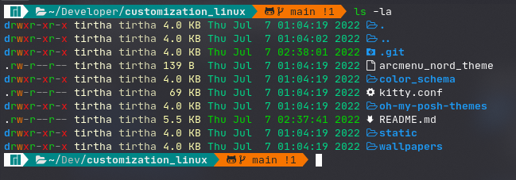
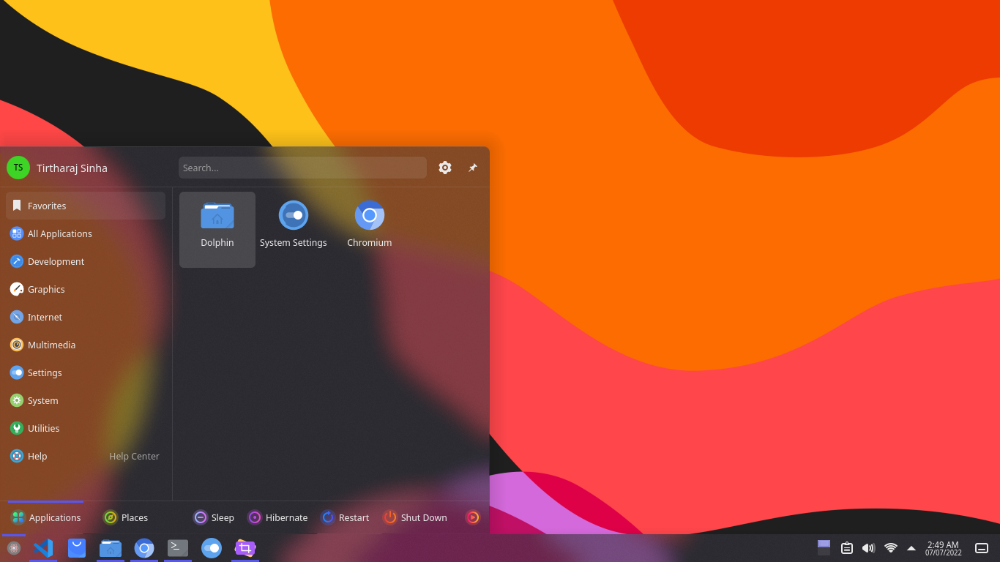
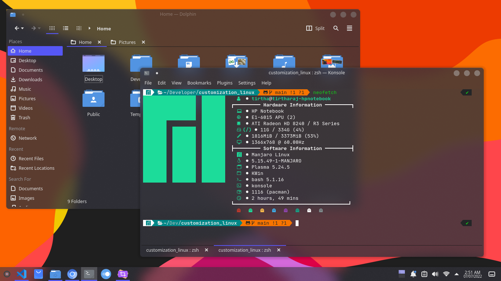

# customization for desktop environment
This repository is a clear-cut guide to customize any desktop and improve workflow.
<p>&nbsp;</p>
<p>&nbsp;</p>

## themes for gnome
> notice : install themes in ~/.themes. if not exists create)
> download and paste the theme folder in ``` ~/.themes``` . (except Qogir, find installation process of Qogir below)


1. [Qogir-dark](https://github.com/vinceliuice/Qogir-theme) // visit how install this theme [below](#install-qogir-theme)
2. [layan-dark](https://www.gnome-look.org/p/1309214/)
3. [Orchis-dark](https://https://github.com/vinceliuice/Orchis-theme)
4. [nordic-darker-40](https://www.gnome-look.org/p/1267246/)

### install Qogir theme
> dowload the ropo as zip and extract it.
> open the terminal in ```Qogir-theme``` folder. 
> run ``` ls ``` comand. there shold be a file called install.sh in the list.
> now run folling command
```
gsettings set org.gnome.desktop.wm.preferences button-layout appmenu:minimize,maximize,close
./install.sh --tweaks image square round -l manjaro
```
put the os name of your choice at the place of  `manjaro`.

> Now open/reopen gnome-tweeks and set Qogir/Qogir-dark/Qogit-light theme from the list.  

<p>&nbsp;</p>
<p>&nbsp;</p>

## icon themes
> notice : install themes in ~/.themes. if not exists create)
> download and paste the icon-theme folder in ``` ~/.icons``` . 
1. [deepinIcons 2022](https://www.gnome-look.org/p/1678986)
2. [candy-icons](https://www.gnome-look.org/p/1305251)
3. [papirus](https://www.gnome-look.org/p/1166289)
4. [bigsur] (https://www.gnome-look.org/p/1399044/)
5. tela
<p>&nbsp;</p>
<p>&nbsp;</p>


# themes for kde plasma
> install kvantum theme of the same theme of your global theme.

> install kvantum manager and install kvantum theme version of your theme.

> change blur in desktop effects in system settings.

1. layan-kde
2. Colloid KDE
3. orchis-kde
4. whitesur-kde

<p>&nbsp;</p>
<p>&nbsp;</p>

## install and setup ulauncher
ulauncher is quick application launcher. search and open inatalled application with some keyboard key press.
A good application to improve productivity.
### install
```
git clone https://aur.archlinux.org/ulauncher.git && cd ulauncher && makepkg -is
```
### autoactive
```
cd /usr/share/applications/
cp ulauncher.desktop ~/.config/autostart/
```

### active using ctrl + space
1. Open Settings > Keyboard (may be named "Keyboard Shortcuts"), then scroll down to Customize Shortcuts > Custom Shortcuts > +
2. In Command enter ulauncher-toggle, set name and shortcut, then click Add

<p>&nbsp;</p>
<p>&nbsp;</p>


## themes for Ulauncher 
> find themes [here](https://gist.github.com/gornostal/02a232e6e560da7946c053555ced6cce)

> run command ``` mkdir -p ~/.config/ulauncher/user-themes ``` .
> paste the theme folder in ``` ~/.config/ulauncher/user-themes ``` . 

1. [nord Theme](https://github.com/KiranWells/ulauncher-nord/)
2. [orchis](https://github.com/kleber-swf/orchis-dark-ulauncher)

<p>&nbsp;</p>
<p>&nbsp;</p>

## theme for gedit
1. vsdark
2. nord
#### Import
  1. Open the preferences
  2. Switch to the *Font & Colors* tab
  3. Click on the *+* labeled button on the left bottom
  4. Import the fevourite .xml file from [color_schema](color_schema) folder.

<p>&nbsp;</p>
<p>&nbsp;</p>

## wallpapers
set wallpaper as your choice<br>
*you can a consider given some wallpaper here in [wallpapers](wallpapers) folder.

<p>&nbsp;</p>
<p>&nbsp;</p>

# simple terminal prompt 
### ( Generated by [bash-prompt-generator.org](https://bash-prompt-generator.org/) )
> Add these below lines in ```~/.bashrc```
```
source /etc/bash_completion.d/git-prompt
export GIT_PS1_SHOWDIRTYSTATE=1

PS1='\[\e[38;5;51m\]\u\[\e[0m\]@\[\e[38;5;84m\]\h\[\e[0m\]:\[\e[38;5;99m\]/\W\[\e[38;5;160m\]$(__git_ps1 " (%s)") \a\n\[\e[0m\]>_ '
```

# terminal prompt (oh my posh)
```
sudo wget https://github.com/JanDeDobbeleer/oh-my-posh/releases/latest/download/posh-linux-amd64 -O /usr/local/bin/oh-my-posh
sudo chmod +x /usr/local/bin/oh-my-posh

mkdir ~/.poshthemes
wget https://github.com/JanDeDobbeleer/oh-my-posh/releases/latest/download/themes.zip -O ~/.poshthemes/themes.zip
unzip ~/.poshthemes/themes.zip -d ~/.poshthemes
chmod u+rw ~/.poshthemes/*.json
rm ~/.poshthemes/themes.zip
```

Now copy all the .opm.json files from [oh-my-posh-themes](oh-my-posh-themes) directory from this repo to ```~/.poshthemes" directory.<br>
Now paste the line below at the end of the file ``` ~/.bashrc ```.
```
eval "$(oh-my-posh --init --shell bash --config ~/.poshthemes/blueish.omp.json)"
```
> Change the blueish with your choice of themes


# terminal Color Scheme(gogh)

Select favourite Color scheme from [gogh-co.github.io/Gogh/](https://gogh-co.github.io/Gogh/)

Now run the command 
```
bash -c  "$(wget -qO- https://git.io/vQgMr)" 
```
find your selected color scheme's serial number and enter it.

Change prompt from terminal emulator preference.

For more info visit [github.com/Gogh-Co/Gogh](https://github.com/Gogh-Co/Gogh)

## Extentions
### install extentions from gnome-look.org
1. blur my shell
   open this extension settings and disable dock and set sigma as choice in range input.
2. vitals
3. dash to dock
   set setting as choice. // set backfround-color to #2e3440
4. arc menu
   open arc menu settings and open misc open and import Nord_arcmenu_theme in menu theme presets and use it in menu theme. 
5. dash to panel // if dash to dock is disabled.

<p>&nbsp;</p>
<p>&nbsp;</p>


## install terminal icons.
```
sudo pacman -S lsd
```
> [View](https://github.com/Peltoche/lsd) other installation

> install Nerd font and use in your terminal.

Check your shell type(bash or zsh)
Now paste the below snippet in your ```~/.bashrc``` or ```~/.zshrc``` at the end and save. 

```
alias ls='lsd'
```
> now open new tab or window of your fav terminal emulator and type  ```ls -l``` and hit enter now you can see some thing like that.




## customize neofetch
1. Inatall the neofetch
2. copy the default config in a file. and remove the old config.
   ```
   cd ~/.config/neofetch
   cp config.conf default.conf   
   rm config.conf
   ```
3. now copy the config the ```config.conf ``` and paste inside the ```~/.config/neofetch``` directory.

> consider [this repo](https://github.com/Chick2D/neofetch-themes) for more themes.


<p>&nbsp;</p>
<p>&nbsp;</p>

# snapshot
## Manjaro gnome

<p>&nbsp;</p>


<p>&nbsp;</p>
<p>&nbsp;</p>

## manjaro kde-plasma


<p>&nbsp;</p>

