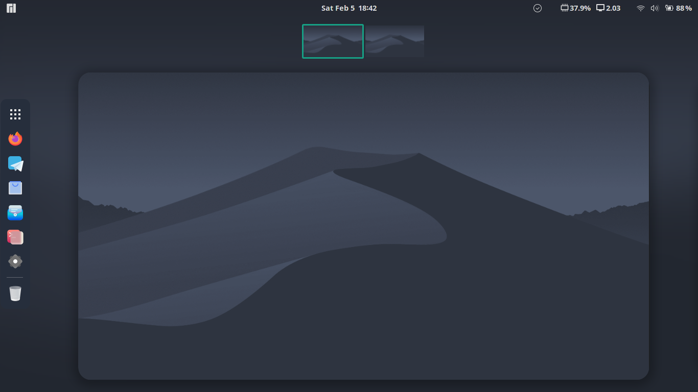
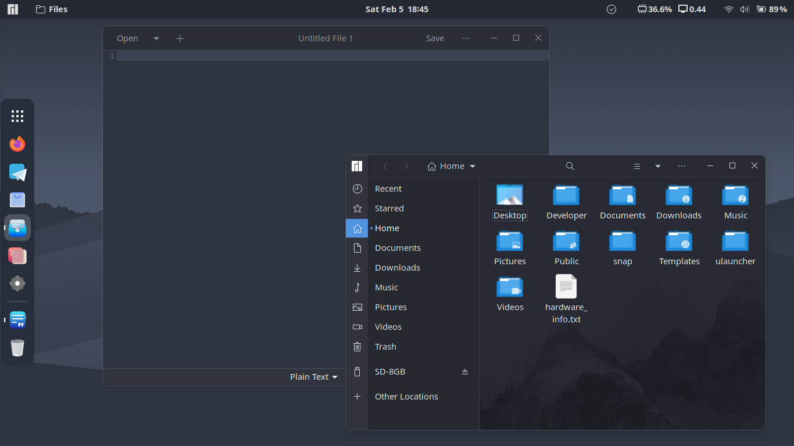

# customization for gnome desktop environment
This repository is a clear-cut guide to customize gnome desktop.
<p>&nbsp;</p>
<p>&nbsp;</p>

## themes for gnome
> notice : install themes in ~/.themes. if not exists create)
> download and paste the theme folder in ``` ~/.themes``` . (except Qogir, find installation process of Qogir below)


1. [Qogir-dark](https://github.com/vinceliuice/Qogir-theme) // visit how install this theme [below](#install-qogir-theme)
2. [layan-dark](https://www.gnome-look.org/p/1309214/)
3. [nordic-darker-40](https://www.gnome-look.org/p/1267246/)

### install Qogir theme
> dowload the ropo as zip and extract it.
> open the terminal in ```Qogir-theme``` folder. 
> run ``` ls ``` comand. there shold be a file called install.sh in the list.
> now run folling command
```
gsettings set org.gnome.desktop.wm.preferences button-layout appmenu:minimize,maximize,close
./install.sh --tweaks image square round -l manjaro
```
put the os name of your choice at the place of  `manjaro`.

> Now open/reopen gnome-tweeks and set Qogir/Qogir-dark/Qogit-light theme from the list.  

<p>&nbsp;</p>
<p>&nbsp;</p>

## icon themes for gnome
> notice : install themes in ~/.themes. if not exists create)
> download and paste the icon-theme folder in ``` ~/.icons``` . 
1. [deepinIcons 2022](https://www.gnome-look.org/p/1678986)
2. [candy-icons](https://www.gnome-look.org/p/1305251)
3. [papirus](https://www.gnome-look.org/p/1166289)
4. [bigsur] (https://www.gnome-look.org/p/1399044/)

<p>&nbsp;</p>
<p>&nbsp;</p>

## install and setup ulauncher
ulauncher is quick application launcher. search and open inatalled application with some keyboard key press.
A good application to improve productivity.
### install
```
git clone https://aur.archlinux.org/ulauncher.git && cd ulauncher && makepkg -is
```
### autoactive
```
cd /usr/share/applications/
cp ulauncher.desktop ~/.config/autostart/
```

### active using ctrl + space
1. Open Settings > Keyboard (may be named "Keyboard Shortcuts"), then scroll down to Customize Shortcuts > Custom Shortcuts > +
2. In Command enter ulauncher-toggle, set name and shortcut, then click Add

<p>&nbsp;</p>
<p>&nbsp;</p>


## themes for Ulauncher 
> find themes [here](https://gist.github.com/gornostal/02a232e6e560da7946c053555ced6cce)

> run command ``` mkdir -p ~/.config/ulauncher/user-themes ``` .
> paste the theme folder in ``` ~/.config/ulauncher/user-themes ``` . 

1. [nord Theme](https://github.com/KiranWells/ulauncher-nord/)
2. [orchis](https://github.com/kleber-swf/orchis-dark-ulauncher)

<p>&nbsp;</p>
<p>&nbsp;</p>

## theme for gedit
1. vsdark
2. nord
#### Import
  1. Open the preferences
  2. Switch to the *Font & Colors* tab
  3. Click on the *+* labeled button on the left bottom
  4. Import the fevourite .xml file from [color_schema](color_schema) folder.

<p>&nbsp;</p>
<p>&nbsp;</p>

## wallpapers
set wallpaper as your choice<br>
*you can a consider given some wallpaper here in [wallpapers](wallpapers) folder.

<p>&nbsp;</p>
<p>&nbsp;</p>

## Extentions
### install extentions from gnome-look.org
1. blur my shell
   open this extension settings and disable dock and set sigma as choice in range input.
2. vitals
3. dash to dock
   set setting as choice. // set backfround-color to #2e3440
4. arc menu
   open arc menu settings and open misc open and import Nord_arcmenu_theme in menu theme presets and use it in menu theme. 
5. dash to panel // if dash to dock is disabled.


<p>&nbsp;</p>
<p>&nbsp;</p>
### snapshot of final result

<p>&nbsp;</p>



